```mermaid
graph LR

A[Ato 1 - Nave] --> B[Pane na nave]
B --> C[Perda de controle]
C --> D[Queda no planeta]

D --> E[Ato 2 - Sobrevivência]
E --> F[Floresta]
F --> G[Robô destruído]

G --> H[Fábrica HOFFMANN]
H --> I[Sucatas]
I --> J[Monstro]

J --> K[Separação]
K --> L[Fuga de Lucas]

L --> M[Ato 3 - Horror]
M --> N[Perseguição]
N --> O[Retorno à nave]

O --> P[Conflito com Alex]
P --> Q[Plano: transmissor]

Q --> R[Volta à fábrica]
R --> S[Reencontro]

S --> T[Dois monstros]
T --> U[Transmissão]

U --> V[Sinal recebido]
V --> W[Leonard]

W --> X[Climax]
X --> Y[Lucas capturado]

Y --> Z[Revelação final - Lucas era Sucata]
```

```radial-timeline
- Ato 1 : Vida na nave
- Incidente : Pane e perda de controle
- Impacto : Queda no planeta

- Ato 2A : Sobrevivência
- Exploração : Floresta desconhecida
- Descoberta : Cabeça de robô destruída

- Mistério : Fábrica HOFFMANN
- Revelação : Origem dos Sucatas

- Midpoint : Primeiro ataque do monstro
- Consequência : Separação do grupo

- Ato 2B : Horror crescente
- Fuga : Lucas escapa sozinho
- Perseguição : Criatura segue até a nave

- Conflito : Alex vs Lucas
- Decisão : Buscar transmissor

- Ato 3 : Retorno à fábrica
- Reencontro : Heitor e Bruno vivos

- Revelação : Dois monstros
- Missão : Enviar sinal de socorro

- Clímax : Transmissão realizada
- Conexão : Leonard recebe sinal

- Queda final : Lucas capturado
- Plot Twist : Lucas era um Sucata
```
